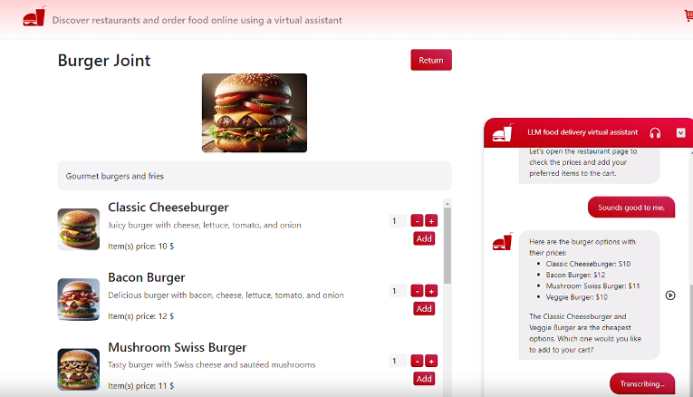

# Table of Contents

1. [LLM for Food Ordering (Proof-of-concept)](#1-llm-for-food-ordering-proof-of-concept)
2. [Full Demo](#2-full-demo)
3. [Quick Set-up](#3-quick-set-up)
   - [3.1. Create a .env](#31-create-a-env)
   - [3.2. Create a Database and Populate It](#32-create-a-database-and-populate-it)
   - [3.3. Configure Your Model](#33-configure-your-model)
   - [3.4. Run It with Docker](#34-run-it-with-docker)
4. [How It Works](#4-how-it-works)
   - [4.1. Data](#41-data)
   - [4.2. Function Calling](#42-function-calling)
     - [4.2.1. RAG for Restaurant Searches](#421-rag-for-restaurant-searches)
   - [4.3. Services](#43-services)
   - [4.4. Handlers](#44-handlers)
   - [4.5. Endpoints](#45-endpoints)
   - [4.6. Frontend Orchestration](#46-frontend-orchestration)
     - [4.6.1. Function Calling Inside Frontend](#461-function-calling-inside-frontend)
     - [4.6.2. Action Registering](#462-action-registering)
5. [More Demos (Extra)](#5-more-demos-extra)
   - [5.1. Searching for a Restaurant, Opening It, Closing It, Adding to Shopping Cart](#51-searching-for-a-restaurant-opening-it-closing-it-adding-to-shopping-cart)
   - [5.2. Action Tracking](#52-action-tracking)
   - [5.3. Auto Text-to-Speech](#53-auto-text-to-speech)
----
----
# 1. LLM for food ordering (Proof-of-concept)

This app demonstrates the concept of an interface orchestrated by an autonomous agent nicknamed "Interface-omniscient" Agent.

The concept is all about giving all the levers to pull to an autonomous chatbot that can help you navigate a website:

- It can open pages and click on buttons by knowing what are the elements in the page
- It can give you information about the current page
- It can track your actions in order to make informed decisions

In this demonstration you can order food autonomously, by voice, with no need to pay attention to a simulated confusing/populated/messy interface, and the chat assistant can also autonomously answer to you using voice.

----
----
# 2. Full demo 

<!-- [](docs/videos/LLM-Delivery-app-demo.mp4) -->
<video width="1360" height="800" controls>
  <source src="docs/videos/LLM-Delivery-app-demo.mp4" type="video/mp4">
</video>

----
----
# 3. Quick set-up

## 3.1. Create a .env
- Create an OpenAI API key
- Create a Pinecone API key and Index named `auto-food-order`
- Find [.env.example](./backend/.env.example) and write your API keys
- Rename `.env.example` to `.env`

## 3.2. Create a database and populate it
- Create a pinecone index
- Create a database following the tutorial in [here](./backend/src/data/README.md)

## 3.3 Configure your model
- Open [config.yaml](./backend/src/config/config.yaml) and choose the model you would like to use (works better with gpt-4 or gpt-4-32k)
- Feel free to tweak the parameters

## 3.4. Run it with docker
- Install docker on your machine
- Run ```docker compose up --build``` and have fun

----
----
# 4. How it works 

### 4.1. Data

The main data used are restaurant names, descriptions, food/beverage items names and descriptions

- All the data was generated by GPT-4

- All the images of restaurants and foods were generated by Dalle-3 using the [image_generator.ipynb](./backend/src/images_generator/image_generator.ipynb) pipeline
- Databases
    - **SQL**: SQLite (sqlalchemy) was used to create the database
    - **Vector DB**: We used the free version of pinecone to store restaurants for restaurant search

Tutorial available in [backend/src/data/README.md](./backend/src/data/README.md)

### 4.2. Function calling

All the possible user-actions were mapped as functions (either dummy or not) in the backend that allows the chatbot to perform it for the user (see [prompts/README.md](./backend/src/prompts/README.md) and [services/README.md](./backend/src/services/README.md))

#### 4.2.1. RAG for restaurant searches

One particular function calling is the Retrieval of restaurants

[Llama-index](https://github.com/run-llama/llama_index) and [Pinecone](https://github.com/run-llama/llama_index) for orchestrating the search, meanwhile [OpenAI Embeddings](https://platform.openai.com/docs/guides/embeddings) were used to encode the restaurant names and descriptions to carry out semantic search

The chatbot can autonomously trigger this search when asked by the user

### 4.3. Services

Services are the main engines used, both from OpenAI and also custom functions that are used by the frontend to perform actions

Find more information in [backend/src/services/README.md](./backend/src/services/README.md)

### 4.4 Handlers

Handlers are classes that will orchestrate data before using a service/engine and sending it to the frontend

Find more information in [backend/src/handlers/README.md](./backend/src/handlers/README.md)


### 4.5. Endpoints

The endpoints functions will receive data from the frontend, use Services and Handlers to manipulate this data and generate an output and then send it back

Find more information in [backend/src/endpoints/README.md](./backend/src/endpoints/README.md)


### 4.6 Frontend orchestration

#### 4.6.1. Function calling inside frontend

In the frontend code there are function call handlers (e.g. [handlePlaceOrder](./frontend/src/components/AppContainer.vue#434)), those are reponsible for carrying out some actions inside the interface

When the user sends a message, if the [chat completion model](./backend/src/services/openai_service/chat_completion.py) decides it is time to call a function it will return a function flagged output with the name of the function to be called

This is routed in the [handleFunctionCall](./frontend/src/components/AppContainer.vue#312) (also see [generateAnswer](./frontend/src/components/AppContainer.vue#279)) function that will call a function handler in the interface to perform an action


#### 4.6.2. Action registering

Most of the frontend actions are registered in natural language in the frontend

[registerAction: function](./frontend/src/components/AppContainer.vue#492)
``` 
registerAction: function(msg) {
    this.actions.push("@action:" + msg + " at " + this.getCurrentTime())
    console.log(this.actions)
},
```

The latest actions are made available to the chatbot on demand within a function calling setup

The chatbot then has the autonomy to decide when to call it to verify the users/its own latest actions and be able to make more informed decisions

Try asking the chatbot: ```What did I just do?``` after interacting with the interface

----
----

# 5. More demos (extra) 

## 5.1. Searching for a restaurant, opening it, closing it, adding to shopping cart


## 5.2. Action tracking


## 5.3. Auto text-to-speech

<!-- [](docs/videos/demo_3.mp4) -->

<video width="1360" height="800" controls>
  <source src="./docs/videos/demo_3.mp4" type="video/mp4">
</video>


----
----